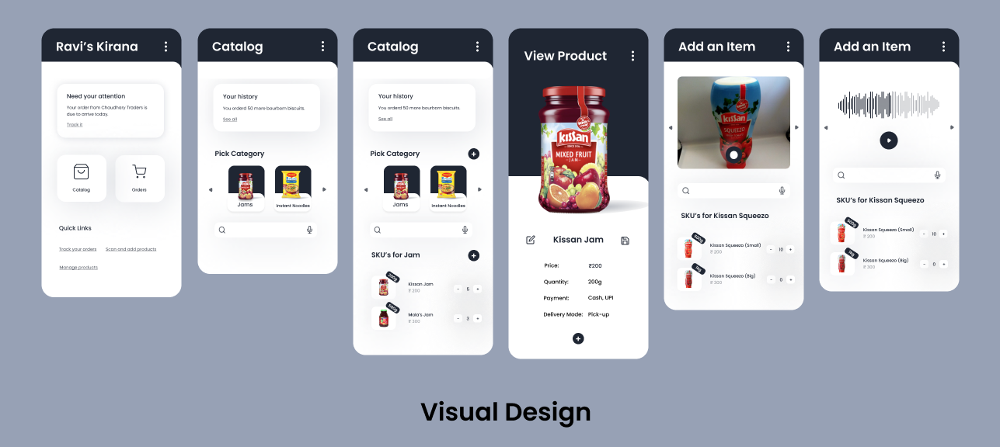

# <div align="center"> `beckn-catalog-management` </div>

> Submission for ONDC Grand Hackathon (Challenge 1 - Digitization of Catalogs)
>
> **Team Makers42**
>
> - Siddhant K (@kineticdesigner42) - grade 7
> - Vedant K (@gamemaker1) - grade 10

This is a Beckn-powered Svelte web component that enables voice based search and
creation of items in a crowdsourced product catalog. It is built using Svelte
and split into modular components that can be embedded in your application
easily. It uses the Webkit Speech Recognition API built into Chromium-based
browsers and fuzzy search to return useful search results.

[Here](https://drive.google.com/file/d/1Ruri4rxWJJN6yy5FdkJTKjcbP8q7sGed/view?usp=sharing)
is a link to a video explaining and demonstrating the prototype.

[](<https://www.figma.com/file/pFLTxI3eLXvnoVyPqCYZZm/ONDC-Hackathon-Design-(Makers42)?node-id=48%3A592>)

## Challenge

### Product Schema

> Define a schema (appropriate for at least 1000 items - an item being a retail
> SKU) for an online catalog for retail.

### Category

#### `id`

- The unique category ID.
- `string`

#### `name`

- The user-visible name of the category.
- `string`

#### `description`

- The user-visible description of the category.
- `string`

#### `image`

- URL to image depicting the category.
- `string`

#### `relatedCategories`

- A list of IDs of categories that are related to this one.
- `string[]`

### Product

#### `id`

- The unique ID of the product (usually the GTIN/USP/etc)
- `string`

#### `name`

- The user-visible name of the product.
- `string`

#### `description`

- The user-visible description of the product.
- `string`

#### `image`

- URL to image depicting the product.
- `string`

#### `category`

- ID of the category this product belongs to.
- `string`

#### `quantity`

- Quantity of item sold (e.g., 500g of washing powder)
- `object`

```json
{
	"magnitude": <number>,
	"unit": "'milligram' | 'grams' | 'kilograms' | 'millilitres' | 'litres' | 'tons' | 'millimetres' | 'centimetres' | 'metres' | 'kilometres'"
}
```

#### `price`

- Final price (including tax) that the buyer needs to pay for the item.
- `object`

```json
{
	"amount": <number>,
	"currency": "'AED' | 'AFN' | 'ALL' | 'AMD' | 'ARS' | 'AUD' | 'AZN' | 'BAM' | 'BDT' | 'BGN' | 'BHD' | 'BIF' | 'BND' | 'BOB' | 'BRL' | 'BWP' | 'BYN' | 'BZD' | 'CAD' | 'CDF' | 'CHF' | 'CLP' | 'CNY' | 'COP' | 'CRC' | 'CVE' | 'CZK' | 'DJF' | 'DKK' | 'DOP' | 'DZD' | 'EEK' | 'EGP' | 'ERN' | 'ETB' | 'EUR' | 'GBP' | 'GEL' | 'GHS' | 'GNF' | 'GTQ' | 'HKD' | 'HNL' | 'HRK' | 'HUF' | 'IDR' | 'ILS' | 'INR' | 'IQD' | 'IRR' | 'ISK' | 'JMD' | 'JOD' | 'JPY' | 'KES' | 'KHR' | 'KMF' | 'KRW' | 'KWD' | 'KZT' | 'LBP' | 'LKR' | 'LTL' | 'LVL' | 'LYD' | 'MAD' | 'MDL' | 'MGA' | 'MKD' | 'MMK' | 'MOP' | 'MUR' | 'MXN' | 'MYR' | 'MZN' | 'NAD' | 'NGN' | 'NIO' | 'NOK' | 'NPR' | 'NZD' | 'OMR' | 'PAB' | 'PEN' | 'PHP' | 'PKR' | 'PLN' | 'PYG' | 'QAR' | 'RON' | 'RSD' | 'RUB' | 'RWF' | 'SAR' | 'SDG' | 'SEK' | 'SGD' | 'SOS' | 'SYP' | 'THB' | 'TND' | 'TOP' | 'TRY' | 'TTD' | 'TWD' | 'TZS' | 'UAH' | 'UGX' | 'USD' | 'UYU' | 'UZS' | 'VEF' | 'VND' | 'XAF' | 'XOF' | 'YER' | 'ZAR' | 'ZMK' | 'ZWL'"
}
```

#### `inventory`

- Number of units currently in stock.
- `number`

#### `channel`

- A list of channels of obtaining product: 'online' (home delivery) or 'offline'
  (pick up from store).
- `('online' | 'offline')[]`

#### `payment`

- A list of modes of payment accepted for the product.
- `('upi' | 'cash' | 'credit-card' | 'debit-card' | 'neft')[]`

#### `relatedProducts`

- A list of IDs of products that are related to this one.
- `string[]`

### Interface

> Develop an intuitive interface, using text or voice or image input or a
> combination of these, for digitizing an item that currently exists in the
> store.

We spoke to a kirana shop owner and the following insights drove the direction
of the prototype:

- The kirana store owner is always on the move around the shop - hence voice on
  the move coupled with easy selection from a list needs to form the basis for
  the user experience
- When they add a product to their store catalog, it is easier for them to
  select a product out of a crowdsourced catalog, and change the quantity and
  price instead of filling out everything.
- If an item is not present in the crowdsourced catalog, they can create a
  product listing and contribute it back to the crowdsourced catalog so that
  others can benefit from it.

[](<https://www.figma.com/file/pFLTxI3eLXvnoVyPqCYZZm/ONDC-Hackathon-Design-(Makers42)?node-id=53%3A631>)

[](<https://www.figma.com/file/pFLTxI3eLXvnoVyPqCYZZm/ONDC-Hackathon-Design-(Makers42)?node-id=48%3A592>)

## Usage

To use the web app, follow these instructions:

- Install `node`: [This guide](https://nodejs.org/en/download/package-manager/)
  will help you install Node. Make sure you are using the
  [active LTS version](https://github.com/nodejs/Release#release-schedule) of
  Node.
- Install `pnpm`: [This guide](https://pnpm.io/installation) will help you
  install PNPM.
- Download the source code: Run `pnpx degit gamemaker1/beckn-catalog-management`
  in a new folder to download the source code.
- Install dependencies: Run `pnpm install` in terminal in the project folder.
- Run the project: Run `pnpm start` in terminal and open
  [`http://localhost:8080`](http://localhost:8080) in your browser to see the
  web app in action.

## Implementation Status

- [x] A schema that describes a product.
- [x] A web component that enables a kirana store owner to:
  - [x] search their catalog with voice input.
  - [x] add a new product to the catalog.
- [ ] API server with endpoints to retrieve and update the crowdsourced catalog.

## License

Copyright 2022 Vedant K <https://github.com/gamemaker1>, Siddhant K
<https://github.com/kineticdesigner42>

This project is licensed under the MIT license. Take a look at the
[`license.md`](license.md) file for the full license text.
